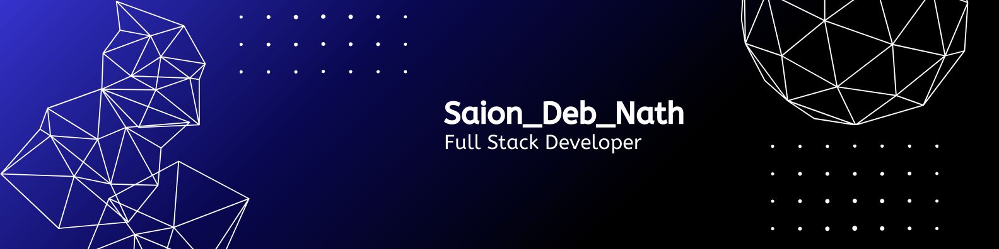

<h1 align="center">Hi 👋 I'm Saion Nath</h1>

📍 Chattogram, Bangladesh  
📧 saionnath@gmail.com

---

## 👨‍💻 About Me

I am a passionate Computer Science and Engineering student who enjoys
building software and solving real-world problems.

I am interested in **backend development, system design, and web applications**.
Currently focusing on improving my programming and development skills.

---

## 🚀 Current Activities

- 🔭 I’m currently working on **React.js, Next.js** for frontend development.
- 🌱 Using **Node.js, Express.js, MongoDB** for the backend.
- 💻 Practicing **problem solving using C++**
- 📚 Exploring **modern web development technologies**

---

## 🛠 TECHNOLOGY STACK

### 💻 Languages

### 🎨 CSS Frameworks & Libraries

### ⚡ JavaScript Frameworks & Libraries

### 🗄 Database

### 🚀 Deployment Platform

### 🎨 Design & Graphics

### 🧰 Tools & Technologies

---

## 🌐 Connect With Me

---

## 📊 GitHub Stats

---

## 💻 Most Used Languages

---

## 🔥 GitHub Streak

---

## 🚀 Featured Projects

---

⭐ From [Saion Nath](https://github.com/SaionNath)
