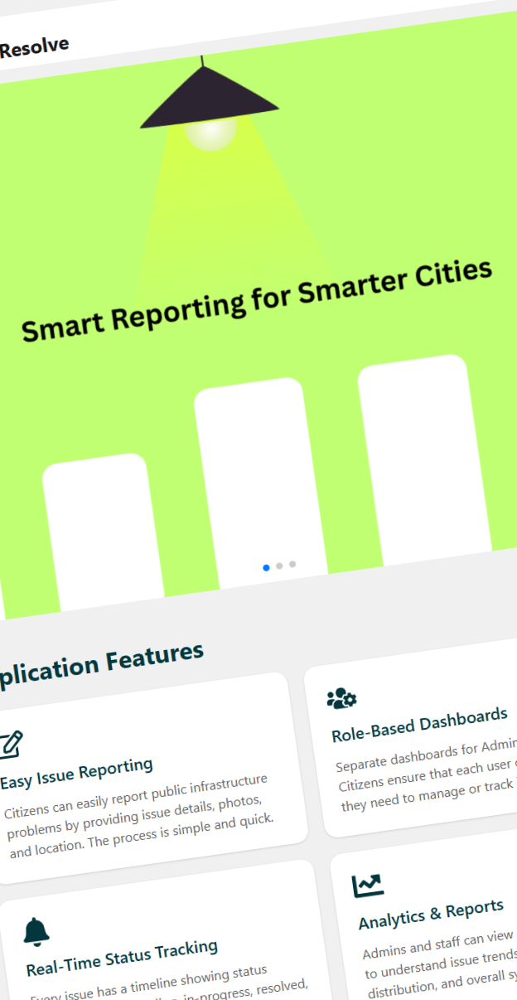
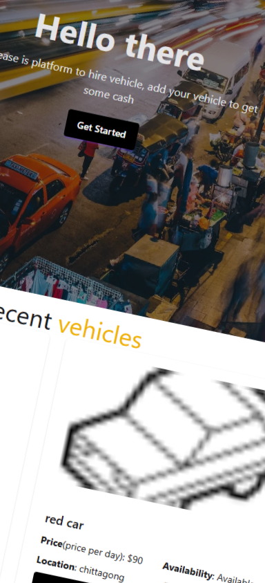

<h1 align="center">Hi 👋 I'm Saion Nath</h1>

📍 Chattogram, Bangladesh  
📧 saionnath@gmail.com

---

<h2 align="center">👨‍💻 About Me</h2>

I am a passionate Computer Science and Engineering student who enjoys
building software and solving real-world problems.

I enjoy building scalable web applications and solving real-world problems through technology.

I am interested in **backend development, system design, and web applications**.
Currently focusing on improving my programming and development skills.

---

<h2 align="center">🚀 Current Activities</h2>

- 🔭 I’m currently working on **React.js, Next.js** for frontend development.
- 🌱 Using **Node.js, Express.js, MongoDB** for the backend.
- 💻 Practicing **problem solving using C++**
- 📚 Exploring **modern web development technologies**

---

<h2 align="center">🛠 TECHNOLOGY STACK</h2>

### 💻 Languages

### 🎨 CSS Frameworks & Libraries

### ⚡ JavaScript Frameworks & Libraries

### 🗄 Database

### 🚀 Deployment Platform

### 🎨 Design & Graphics

### 🧰 Tools & Technologies

---

<h2 align="center">🌐 Connect With Me</h2>

---

<h2 align="center">📊 GitHub Stats</h2>

---

<h2 align="center">💻 Most Used Languages</h2>

---

<h2 align="center">🔥 GitHub Streak</h2>

---

<h2 align="center">🚀 Featured Projects</h2>

<table>
<tr>
<td width="50%">

<h3 align="center">🏙️ City Resolve</h3>

A public infrastructure issue reporting system that connects citizens,
staff, and administrators to manage city problems efficiently.

<a href="https://city-resolve-client.web.app">🌐 Live Demo</a> |
<a href="https://github.com/SaionNath/city-resolve-client">💻 Repository</a>

</td>

<td width="50%">

<h3 align="center">✈️ Travel Ease</h3>

A tourism platform designed to help users explore destinations and
plan their trips easily with an interactive interface.

<a href="https://travel-ease-a32b9.web.app">🌐 Live Demo</a> |
<a href="https://github.com/SaionNath/Travel_Ease_client">💻 Repository</a>

</td>
</tr>
</table>

---

⭐ From [Saion Nath](https://github.com/SaionNath)
